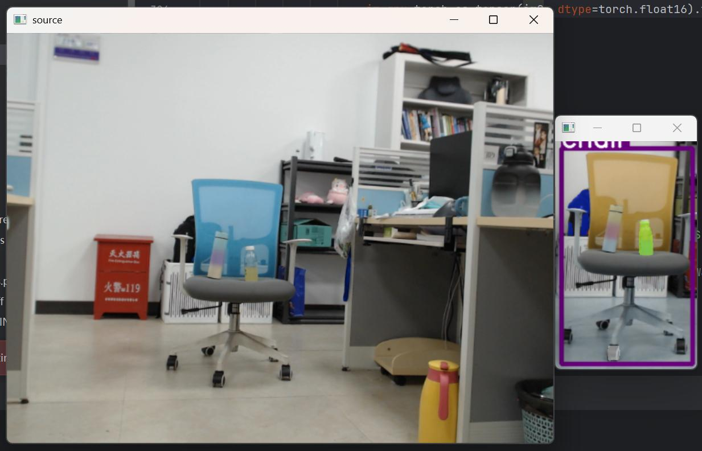
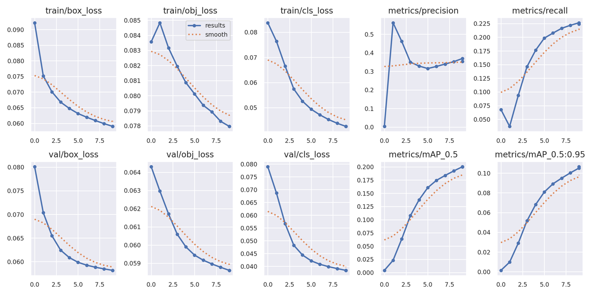
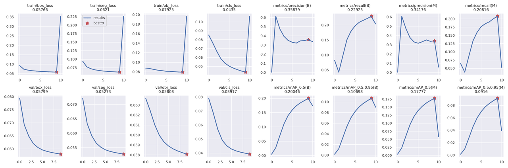

1、检测算法

输入：视频流，图片，文件地址

输出：检测窗口的分割

效果：

检测出椅子，并对椅子的检测窗口进行分割

训练结果：

检测：

分割：

代码：yolov5

2、窗口掩码算法

输入:图片

输出：对窗口的掩码

效果：

将窗口的位置变为黑色

代码：masking_win.py

3、空白标签创建算法

输入：图片路径、标签路径

输出：对没有标签的图片（无目标图片）建立空白标签

代码：data1.py

4、米浆分类辅助脚本

输入：原图片文件夹

输出：将图片划分为clean，dirty，unknown三个文件夹

代码：data2.py

